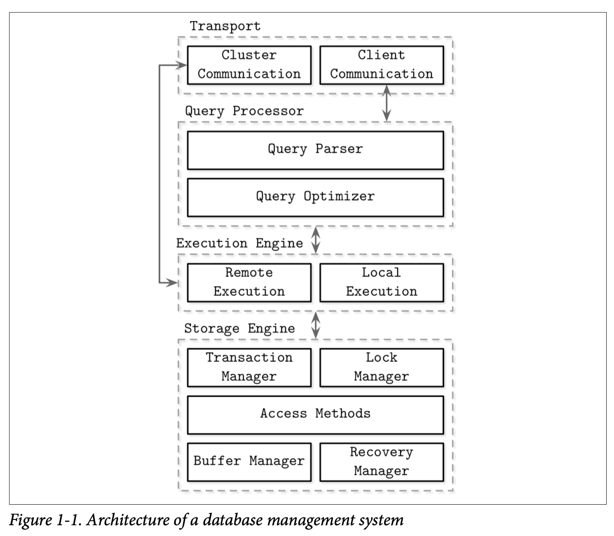
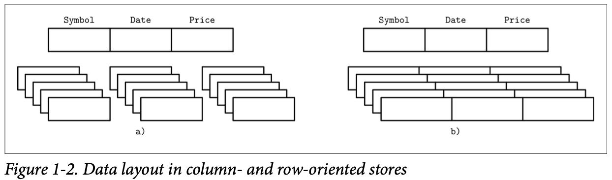
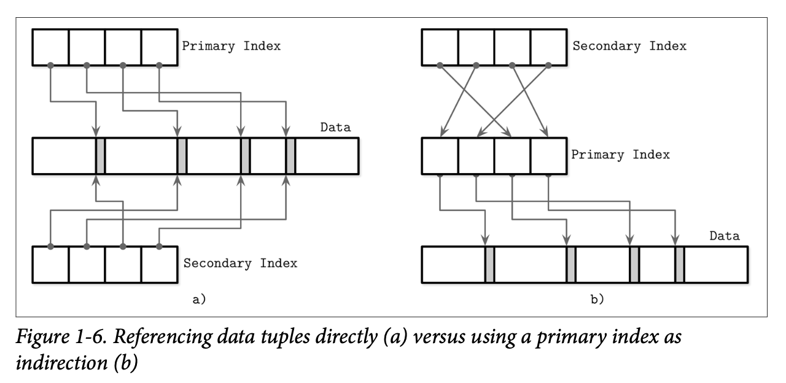
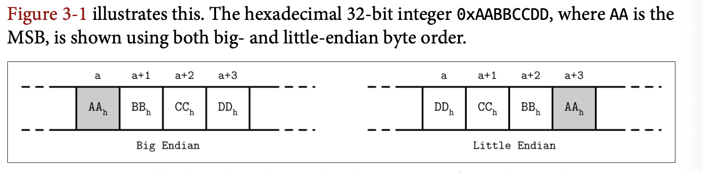
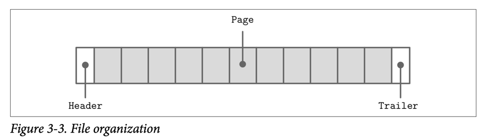
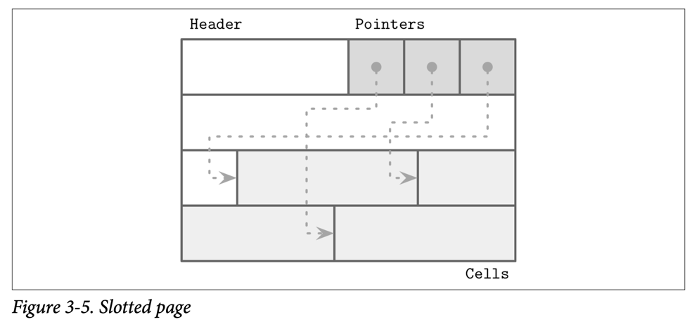
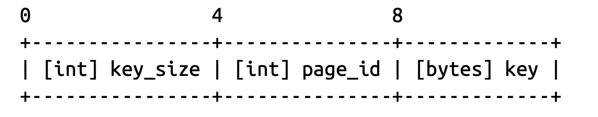
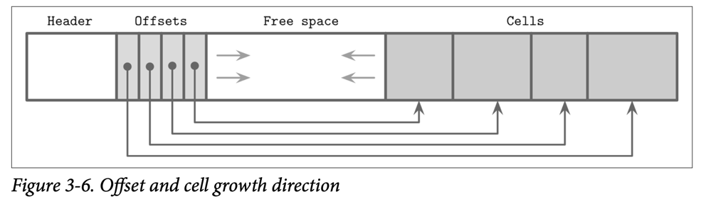
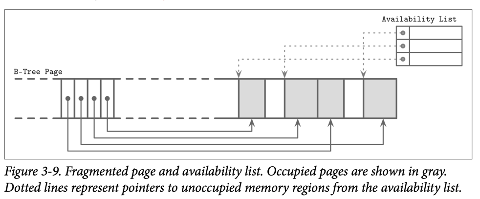

# Database Internals

## Chapter 1: Intro and Overview

### DBMS Architecture:
- Every DB is built slightly different, but there are some common themes.
- DBMS is a client/server model, where DBMS instance (node) is the server, and application instance is client.



- Transport Subsystem:
	+ Receives client requests. Requests come in the form of queries, most often expressed in some query language.
	+ Also responsible for comminucation with other nodes in the db cluster

> Upon receipt, the transport subystem hands the query over to a query processer

- Query Processor:
	+ Query parser: Parses interprets, and validates the query. Later, access control checks are performed, as they can be done fully only after the query is interpreted

	+ Query optimizer: The parsed query is passed to the query optimizer. The query is usually presented in the form of an execution plan (query plan): a sequence of ops that have to be carried out for its results to be considered complete. Since the same query can be satisfied using different execution plans that can vary in efficiency, the optimizer picks the best available plan

> The execution plan is handled by the execution engine

- Execution engine:
	+ the execution plan is handled by the execution engine, which collects the results of execution of local and remote operations

> For local queries, execution engine ask storage engine to retrieve the data

- Storage Engine:
	+ Transaction manager: Schedules transactions and ensures they cannot leave the database in a logically inconsistent state

	+ Lock manager: Locks on the database objects for the running transactions, ensuring that concurrent operations do not violate physical data integrity

	+ Access methods (storage structure): These manage access and organizing data on disk. Access methods include heap files and storage structures such as B-Trees

	+ Buffer manager: This manager caches data pages in memory

	+ Recovery manager: Maintains the operation log and restoring the system state in case of a failure

	+ Together, transaction manager and lock manager are responsible for concurrency control

### Memory vs Disk-Based DBMS

- In-memory dbms:
	- Maintain backups on disk to provide durability and prevent loss of the volatile data
	- Before the operation can be considered complete, its results have to be written to a sequential log file
	- In-memory stores maintain a backup copy and periodically update it asynchronously. During recovery, database contents can be restored from the backup and logs
	- Log records are usually applied to backup in batches. After the batch of log records is processed, backup holds a database snapshot for a specific point in time, and log contents up to this point can be discarded. This process is called CHECKPOINTING
	
- Disk-based DMS:
	- Specialized storage structure, optimized for disk access
	- Disk-based storage structures often have a form of wide and short trees

### Column vs Row-Oriented DBMS

- One of the ways to classify databases is by how the data is stored on disk: row- or column-wise

- Tables can be partitioned either horizontally (storing values belonging to the same row together), or vertically (storing values belonging to the same column together).



- Row-oriented DBMS:
	- Stores data in records or rows
	- Useful in scenarios where we access data by row, storing entire rows together improves spatial locality (fields on same row are adjacent)
	- Expensive when accessing individual fields of multiple user records

- Column-oriented DMS:
	- Stored data vertically
	- Good for queries by column

### Data Files and Index Files

- Database systems do use files for storing the data, but instead of relying on filesystem hierarchies of directories and files for locating records, they compose files using implementation-specific formats. The main reasons to use specialized file organization over flat files are:
	+ Storage efficiency: Files are organized in a way that minimizes storage overhead per stored data record
	+ Access efficiency: Records can be located in the smallest possible number of steps

- DBMS store data records, consisting of multiple fields, in tables, where each table is usually representated as a separate file

- To locate a record, DBMS uses indexes: auxiliary data structures that allow it to efficiently locate data records without scanning an entire table on every access. Indexes are built using a subset of fields identifying the record

- DBMS usually separates data files and index files. Filesare partitioned into pages, which typically have the size of a single or multiple disk blocks. Pages can be organized as sequences of records or as a slotted pages

- New records (insertions) and updates to the exisiting records are represented by key/value pairs. Most modern storage systems do not delete data from pages explicitly. Instead, they use deletion markers (also called tombstones), which contain deletion metadata, such as a key and a timestamp. Space occupied by the records shadowed by their updates or deletion markers is reclaimed during garbage collection, which reads the pages, writes the live (i.e., nonshadowed) records to the new place, and discards the shadowed ones

### Data Files

- Data files (also called primary files), can be implemented as index-organized tables (IOT), heap-organized tables (heap files), or hash-organized tables (hashed files).

- Heap files:
	+ Records are not required to follow any particular order --> No additional work or file re-organization is required when new pages are appended.
	+ Requires additional index structures, pointing to the locations where data records are stored, to make them searchable

- Hashed files:
	+ Records are stored in buckets
	+ Hash value of key determines which bucket a record belongs to

- Index-organized tables (IOTs):
	+ Stores data records in the index itself --> Reduces the number of disk seek

### Index Files

- An index is a structure that organizes data records on disk in a way that facilitates efficient retrieval operations.

- Index files are organized as specilized structure that map keys to locations in data files where the records identified by these keys (in case of heap files) or primary keys (in case of index-organized tables) are stored

- An index on a primary file is called a primary index
	+ In most cases, primary index is built over a primary key or a set of keys identified as primary. All other indexes are secondary

- Secondary index:
	+ Can point directly to the data record, or simply store it primary key
	+ Multiple secondary indexes can point to the same record
	+ Secondary indexes may hold several entries per search key

- Clustered index:
	+ Order of data records follows the search key order
	+ Data records are usually stored in the same file of in a clustered file

- Non-clustered index:
	- Data stored in a separate file, and its order does not follow the key order

### Primary Key As An Indirection

- Referencing data directly:
	+ Reduce # of disk seeks
	+ Pay the extra cost of updating the pointers whenever the record is updated || relocated during a maintenance process

- Indirection through primary index:
	+ Reduce cost of pointers update
	+ Higher cost on read path



- It is also possible to use a hybrid approach and store both data file offsets and primary keys. First, you check if the data offset is still valid and pay the extra cost of going through the primary key index if it has changed, updating the index file after finding a new offset.

### Buffering, Immutability, and Ordering

- A storage engine is based on some data structure. However, these structures do not describe the semantics of caching, recovery, transactionality, and other things that storage engines add on top of them.

- Storage structures of 3 common variables: they use Buffering (or avoid using it), use immutable (or mutable) files, and store values in order (or out of order)

- Buffering:
	+ Defines whether or not the storage structure chooses to collect a certain amount of data in memory before putting it to disk

- Mutability:
	+ Defines whether or not the storage structure reads parts of of the file, updates them, and writes the updated results at the same location in the file
	+ Immutable structures are append-only: once written, file contents are ot modified.

- Ordering:
	+ Defines whether or not the data records are stored in the key order in the pages on disk. In other words, the keys that sort closely are stored in contiguous segments on disk
	+ Ordering often defines whether or not we can efficiently scan the range of records, not only locate the individual data records

## Chapter 2: B-Tree Basics

- One of the most popular storage structure is a B-Tree

- Why BST is not a good alternative as a disk datastructure?
	+ Low fanout (fanout is the number of maximum allowed number of children per node), which reduce spatial locality
	+ Low fanout -> Increased tree height -> More disk seeks during traveral

- A version of the tree that would be better suited for dusk implementation has to exhibit the following props:
	+ High fanout to improve locality of the neighboring keys
	+ Low height to reduce the number of seeks during traversal

### B-Tree

- Smallest unit of disk data retrival is block, which is usually 512 bytes.

- Imagine data storage:
	+ Each entry in the table is 128B
	+ There are 1000 entries in total
	+ There is no index

	-> In the worst case, querying 1 entry can require up to 250 disk accesses
	-> Bad performance

	+ If there is a single level index (each index has a pointer to one entry stored on disk), and each index entry is 16 bytes
	+ In one read, we can each 32 index entries

	-> We only need at most (1000/32) + 1 = 33 disk accesses
	-> This is better, but we can still improve my setting a second level index

	+ Say we set up the second level index, which points to a block worth of first level index (32 entries), then we will have 32 second level indexes (each is 16B) -> 1 disk read can read the all second level indexes
	+ To find an entry, we need at most 1 + 1 + 1 = 3 disk accesses

	-> This is better

	-> With increasing number of entries, the number of index levels will increase

	-> We need a way - an algorithm - to do this index level creation automatically

	-> B-Tree is the data structure that allows us to do that

- B-Tree is an multiway search tree with some additional properties:
	+ Balanced: All leaf nodes are at the same level, ensuring consustent access time for any key
	+ Variable Node Size: Keys within each node are sorted in ascending order, enabling efficient searching and sequential access
	+ Sorted keys: Keys within each node are sorted in ascending order, enabling efficient searching and sequential access
	+ Minimum and Maximum Keys: Each node (except the root) as a minimum and maximum number of keys, ensuring balance and preventing extreme scenarios
	+ Minimum Degress (m): A B-Tree of order m has nodes with a maximum of m children
	+ Internal Nodes: Internal nodes (except the root) have between `ceil(m/2)` and m children
	+ Root Node: The root node can be a leaf or an internal node with 2 to m children
	+ Leaf Node: Leaf nodes do not have children and are all at the same level

- B-Tree vs B+-Tree:
	- B+-Tree: 
		+ Only leaf nodes have record pointers
		+ Every key will have its copy in the leaf node
		+ Leaf nodes are connected like a linked list

- To create a disk-based implementatiion, we need to go into details of how to layout B-Tree nodes on disk and compose on-disl layout using data-encoding formats

## Chapter 3: File Formats
### Binary encoding
- To store data on disk efficiently, it needs to be encoded using a format that is compact and easy to serialize and deserialize. 
- Here we discuss the main principles used to create efficient page layouts. These principles apply to any binary format.

#### Primitive Types
- Most numeric data types are represented as fixed-size values. When working with multibyte numeric values, it is important to use the same byte-order(endianness) for both encoding and decoding:
  - Big-endian: The order starts from the most-significant byte (MSB), followed by the bytes in decreasing significance order
  - Little-endian: The order starts from the lest-significant bytes (LSB), followed by the bytes in increasing significance order
  
	

- Different numeric types may vary in size. byte value is 8 bits, short is 2 bytes (16 bits), int is 4 bytes (32 bits), and long is 8 bytes (64 bits)

- Floating-point numbers (float and double) are represented by their sign, fraction, and exponent

#### Strings and Variable-Size Data
- All primitive numeric types have a fixed size. Composing more complex values together is much like a `struct` in C. We can combine primitive values into structures and use fixed-size arrays or pointers to other memory regions

- Strings and other variable-size data types (such as arrays or fixed-size data) can be serialized as a number, representing the length of the array or string, followed by `size` bytes: the actual data:

```
String {
	size	unit_16
	data	byte[size]
}
```

#### Bit-Packed Data: Booleans, Enums, and Flags
- Booleans can be represented either by using a single byte, or encoding true and false as 1 and 0 values. Since a boolean has only two values, using an entire byte for its representation is wasteful, and developers often batch boolean values together in groups of eight, each boolean occupying just one bit. We say that every 1 bit is set and every 0 bit is unset or empty.

- Enums, short for enumerated types, can be represented as integers and are often used in binary formats and communication protocols. Enums are used to represent often-repeated low-cardinality values. For example, we can encode a B-Tree node type using an enum:

```
enum NodeType {
	ROOT,		// 0x00h
	INTERNAL,	// 0x01h
	LEAF		// 0x02h
}
```

- Another closely related concept is flags, kind of a combination of packed booleans and enums. Flags can represent nonmutually exclusive named boolean parameters. For example, we can use flags to denote whether or not the page holds value cells, whether the values are fixed-size or variable-size, and whether or not there are over‐flow pages associated with this node. Since every bit represents a flag value, we can only use power-of-two values for masks (since powers of two in binary always have a single set bit)

- Just like packed booleans, flag values can be read and written from the packed value using bitmasks and bitwise operators

### General Principles
- The file usually starts with a fixed-size header and may end with a fixed-size trailer, which hold auxiliary information that should be accessed quickly or is required for decoding the rest of the file. The rest of the file is split into pages



#### Page Structure
- DBMS store data records in data and index files. These files are partitioned into fixed-sze units called `pages`, which often have a size of multiple filesystem blocks. Page sizes usually range from 4-16Kb

- Each B-Tree node occupies one page or multiple page linked together, so in the context of B-Trees, the terms `node` and `page` (and even `block`) are often used interchangeably

#### Slotted Pages
- When storing variable-size records, the main problem is free space management: reclaiming the space occupied by removed records. For example: If we attempt to put a record of size n into the space previously occupied by the record of size m, unless m == n or we can find another record that has a size exactly m – n, this space will remain unused

- Space reclamation can be done by simply rewriting the page and moving the records around, but we need to preserve record offsets, since out-of-page pointers might be using these offsets. It is desirable to do that while minimizing space waste, too.
  
- To summarize, we need a page format that allows us to:
  - Store variable-size records with a minimal overhead.
  - Reclaim space occupied by the removed records.
  - Reference records in the page without regard to their exact locations.

--> SLOTTED PAGE!

- We organize the page into a collection of `slots` or `cells` and split out pointers and cells in 2 independent memory regions residing on different sides of the page. This means that we only need to reorganize pointers addressing the cells to preserve the order, and deleting a record can be done either by nullifying its pointer or removing it.

- A slotted page has a fixed-size header that holds important information about the page and cells. Cells may differ in size and can hold arbitrary data: keys, pointers, data records, etc...



- Problems solved:
  - Minimal overhead: the only overhead incurred by slotted pages is a pointer array holding offsets to the exact positions where the records are stored.
  - Space reclamation: space can be reclaimed by defragmenting and rewriting the page.
  - Dynamic layout: from outside the page, slots are referenced only by their IDs, so the exact location is internal to the page.

#### Cell Layout
- Using flags, enums, and primitive values, we can start designing the cell layout, then combine cells into pages, and compose a tree out of the pages.

- On a cell level, we have a distinction between key and key-value cells. Key cells hold a separator key and a pointer to the page between two neighboring pointers. Key-value cells hold keys and data records associated with them.

- To compose a key cell, we need to know:
  - Cell type (can be inferred from the page metadata)
  - Key size
  - ID of the child page this cell is pointing to
  - Key bytes
	

- To compose a key-value cell:
	- Cell type (can be inferred from the page metadata)
	- Key size
	- ID of the child page this cell is pointing to
	- Key bytes
    - Data record bytyes
	
#### Combining Cells into Slotted Pages
- To organize cells into pages, we can use the slotted page technique that we discussed previously. We append cells to the right of the page (toward its end), and keep cell offsets/pointers in the left side of the page
	

- Keys can be inserted out of order and their logical sorted order is kept by sorting cell offset pointers in key order. This design allows appending cells to the page with mini‐mal effort, since cells don’t have to be relocated during insert, update, or delete operations.

#### Managing Variable-Size Data
- Removing an item from the page does not have to remove the actual cell and shift other cells to reoccupy the freed space. Instead, the cell can be marked as deleted and an in-memory availability list can be updated with the amount of freed memory and a pointer to the freed value. The availability list stores offsets of freed segments and their sizes. When inserting a new cell, we first check the availability list to find if there’s a segment where it may fit
	

- Fit is calculated based on the strategy:
  - First fit: Might cause large overhead, since the space remaining after reusing the
 	fist suitable segment might be too small to fit any other cell, so it will be effectively wasted.

  - Best fit: Try to find a segment for which insertion leaves the smallest remainder

- If we cannot find enough consecutive bytes to fit the new cell but there are enough fragmented bytes available, live cells are read and rewritten, defragmenting the page and reclaiming space for new writes. If there’s not enough free space even after defragmentation, we have to create an overflow page
