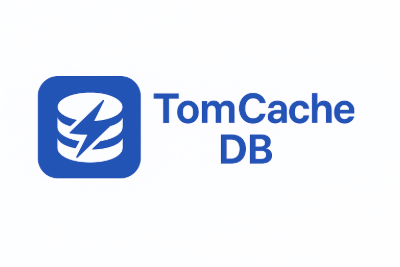

### TomCache DB is a relational, queryable, in-memory database and cache designed for modern applications that need blazing-fast access to structured data.

---

## Core features

- Relational Model: Stores structured data with tables, rows, and columns like a traditional SQL database.

- Queryable via SQL: Select your data using a familiar, lightweight SQL syntax.

- Caching Mechanism with TTL and auto refresh.

- In-Memory and Disk Support: Operates primarily in-memory for speed, with optional persistence to disk.

- Fast Reads, optimized for low latency data access.

- Embeddable and lightweight core that can be embedded directly into any applications.

- Transactions and Concurrency supports: Multi-threaded reads and writes with transactional guarantees.

- External Data Source Sync: Connects to your existing databases or APIs to refresh and update cache entries automatically.

